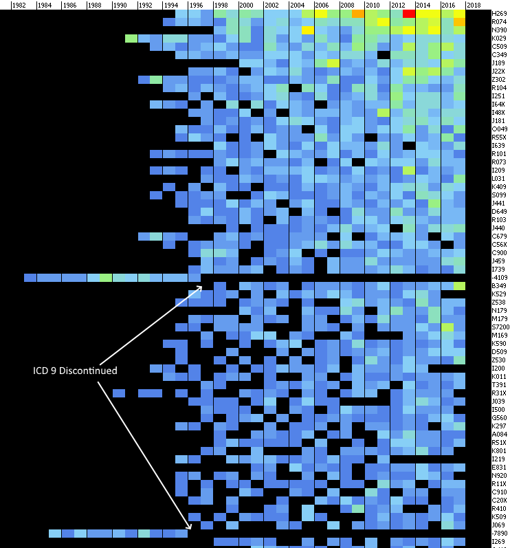

# BadMedicine
Library and CLI for randomly generating medical data like you might get out of an Electronic Health Records (EHR) system

## Command Line Usage:

Bad Medicine can be run from the command line:

```
dotnet BadMedicine.dll c:\temp\
```

You can change how much data is produced (e.g. 500 patients, 10000 records per dataset):

```
dotnet BadMedicine.dll c:\temp\ 500 10000
```

Or run only a single dataset:

```
dotnet ./BadMedicine.dll c:\omg 5000 200000 -l -d CarotidArteryScan
```

You can seed the generator (Guids generated will still differ)

```
dotnet ./BadMedicine.dll c:\omg 5000 200000 -l -d CarotidArteryScan -s 5000
```

## Library Usage

You can generate test data for your program yourself:

```csharp
//Seed the random generator if you want to always produce the same randomisation
var r = new Random(100);

//Create a new person
var person = new Person(r);

//Create test data for that person
var a = new HospitalAdmissionsRecord(person,person.DateOfBirth,r);

Assert.IsNotNull(a.Person.CHI);
Assert.IsNotNull(a.Person.DateOfBirth);
Assert.IsNotNull(a.Person.Address.Line1);
Assert.IsNotNull(a.Person.Address.Postcode);
Assert.IsNotNull(a.AdmissionDate);
Assert.IsNotNull(a.DischargeDate);
Assert.IsNotNull(a.Condition1);
```

## Datasets

The following synthetic datasets can be produced.

| Dataset        | Description           |
| ------------- |:-------------:|:------:|
| Demography      | Address and patient details as might appear in the CHI register |
| Biochemistry      | Lab test codes as might appear in Sci Store lab system extracts |
| Prescribing      | Prescription data of prescribed drugs |
| Carotid Artery Scan      | Scan results for Carotid Artery |
| Hospital Admissions | ICD9 and ICD10 codes for admission to hospital |

## What is Modelled?

Data generated by BadMedicine is driven by Aggregate distributions of real health data collected in Tayside (UK).  This means that codes appear in data with the frequency that match real data.  For example in the Hospital Admissions data we can see that ICD9 codes (denoted by dash) cease being recorded in ~1997 in favour of ICD10 codes and we can see the most common admission conditions are sensible:



*ICD 9 and ICD 10 codes in Condition1 (the main condition) upon Hospital Admission*

## What is not Modelled?

No inter dataset / inter record level randomisation model exists.  For example the following would **not** be modelled:

- If a patient is on Drug A they are more likely to also be on Drug B
- Hospitalisations are more likely to be at the beginning/end of a patients life
- Drug A is likely to be given to patients discharged having been treated for condition Y
